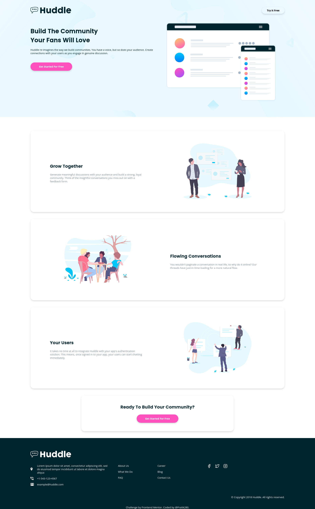
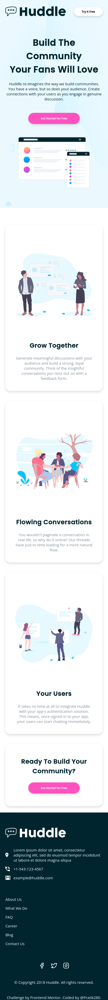

# Frontend Mentor - Huddle landing page with alternating feature blocks solution

This is a solution to the [Huddle landing page with alternating feature blocks challenge on Frontend Mentor](https://www.frontendmentor.io/challenges/huddle-landing-page-with-alternating-feature-blocks-5ca5f5981e82137ec91a5100). Frontend Mentor challenges help you improve your coding skills by building realistic projects. 

## Table of contents

- [Overview](#overview)
  - [The challenge](#the-challenge)
  - [Links](#links)
  - [Screenshot](#screenshot)
- [My process](#my-process)
  - [Built with](#built-with)
- [Author](#author)

## Overview

### The challenge

Users should be able to:

- View the optimal layout for the site depending on their device's screen size
- See hover states for all interactive elements on the page

### Screenshot

<<<<<<< HEAD

=======

>>>>>>> origin/main

### Links

- Source Code : [Github](https://github.com/Pratik280/huddle-landing-page-with-alternating-feature-blocks)
- Live Site : [https://pratik280.github.io/huddle-landing-page-with-alternating-feature-blocks/](https://pratik280.github.io/huddle-landing-page-with-alternating-feature-blocks/)

## My process

### Built with

- Semantic HTML5 markup
- CSS custom properties
- SASS
- Flexbox
- CSS Grid
- Mobile-first workflow

## Author

- Frontend Mentor - [@Pratik280](https://www.frontendmentor.io/profile/Pratik280)
